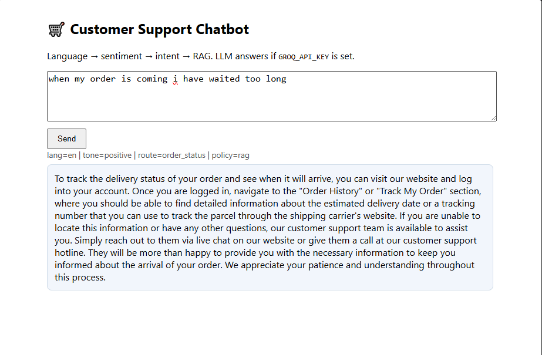

# RAG-Based E-commerce Customer Support Chatbot — NLP Final Task 2026

A single end-to-end pipeline built from four NLP modules. Every customer
message goes through **language → sentiment → intent → Q&A (RAG)** before a
response is produced. All four modules are delivered as **standalone Jupyter
notebooks** — each one runs on Google Colab from just the `.ipynb` file — plus
a Flask API.

```
        ┌──────────────┐   ┌──────────────┐   ┌───────────────┐
message │  01 language │ → │  02 sentiment│ → │  03 intent    │
   ───▶ │  detection   │   │   emotion    │   │  routing      │
        │  20 languages │   │  3 tone buckets│   │  7 routes     │
        └──────────────┘   └──────────────┘   └───────────────┘
                                                      │  policy
                 ┌──────────────┬─────────────────────┼──────────────────┐
                 ▼              ▼                     ▼                  ▼
            small talk      complaint /         no confident     RAG: retrieve KB
            canned reply    human request       retrieval         (FAISS, MiniLM)
            (no RAG)        apologise +         honest "can't      + Groq gpt-oss
                            escalate           help"               grounded answer
```

---

## Screenshots


*The running chatbot — Flask demo page at `http://127.0.0.1:8000`.*

---

## Project layout

```
Chatbot/
├── notebooks_colab/        # the four module notebooks — STANDALONE / Colab-ready
│   ├── 01_language_detection.ipynb
│   ├── 02_sentiment_emotion.ipynb
│   ├── 03_intent_classifier.ipynb
│   ├── 04_rag_pipeline.ipynb
│   ├── _src/*.py           # plain-text sources the .ipynb files are built from
│   └── README.md           # step-by-step guide to running them on Google Colab
├── support_bot/            # runtime package used ONLY by the Flask API
│   ├── config.py           #   artifact paths, dataset ids, label maps
│   ├── sentiment.py        #   EmotionBiLSTM + tokeniser + save/load
│   ├── intent.py           #   small-talk rules + route classifier loader
│   ├── retriever.py        #   FAISS helpers
│   ├── llm.py              #   Groq client + prompt template
│   └── pipeline.py         #   SupportBot.answer() — full 4-stage chat
├── deploy/
│   ├── app.py              # Flask API (/chat, /health)
│   └── test_api.py         # smoke-tests the running API
├── tools/
│   ├── build_colab_notebooks.py   # _src/*.py  ->  notebooks_colab/*.ipynb
│   ├── import_colab_artifacts.py  # chatbot_artifacts/ -> models/ + kb_index/
│   ├── add_colab_bootstrap.py     # one-off: insert a Colab bootstrap cell in a source
│   └── build_notebooks.py         # legacy builder for the old notebooks/ layout
├── data/                  # dataset caches (bitext_raw.csv etc.)
├── models/                # trained artifacts the API loads
│   ├── language/  sentiment/  intent/
├── kb_index/              # FAISS index + meta + count (served by the API)
├── chatbot_artifacts/     # flat artifact folder the notebooks write (see below)
├── Screenshots/
├── design_decisions.md
└── requirements.txt
```

Two independent layouts are at play:

* **Notebooks (train)** write flat files into a single **artifact folder**
  (`chatbot_artifacts/` locally, `/content/chatbot_artifacts` on Colab).
* **The Flask API (serve)** reads a fixed layout — `models/<module>/`,
  `kb_index/`, and a *whole-model* `sentiment/model.pt`.

`tools/import_colab_artifacts.py` is the bridge between the two.

## 1) Install

Python 3.11+ (developed & verified on 3.14, CPU-only).

```bash
python -m venv .venv
.venv\Scripts\activate                 # Windows  (mac/linux: source .venv/bin/activate)
python -m pip install -r requirements.txt
```

## 2) Train the four modules (standalone notebooks)

The notebooks live in `notebooks_colab/`. They are **fully self-contained**: no
`support_bot` import, no project folder, no config file — each downloads its own
dataset from HuggingFace and saves its trained model into the shared **artifact
folder** (`./chatbot_artifacts` locally, `/content/chatbot_artifacts` on Colab;
override anywhere with the `ARTIFACT_DIR` env var). Notebook **04 loads the
models that 01–03 saved** from that folder, so run them **01 → 02 → 03 → 04 in
the same runtime/session**.

**Run locally** (e.g. in VS Code, or `jupyter lab` at the project root):

```bash
jupyter lab                          # then open notebooks_colab/*.ipynb
```

**Run on Google Colab** — upload only the `.ipynb` files and press *Run all*
(run order 01 → 04 in one session). The first cell auto-installs missing
packages. See `notebooks_colab/README.md` for the full walkthrough
(including adding the Groq secret via the 🔑 Secrets panel).

The first code cell of each notebook has a `SMOKE` switch:
`SMOKE = True` trains on a tiny sample in under a minute (useful to check the
code path); the default `SMOKE = False` is the **full training run** that
produces the final artifacts. (Or set the env var `PROJECT_SMOKE=1`.)

Artifacts produced by the notebooks (flat artifact folder):

| module | notebook | files written |
|---|---|---|
| language | 01 | `language_pipeline.pkl`, `language_report.json` |
| sentiment | 02 | `sentiment_checkpoint.pt`, `sentiment_meta.json` |
| intent | 03 | `intent_pipeline.pkl`, `route_map.json` |
| KB + RAG | 04 | `faiss.index`, `kb_meta.pkl` |

> The `.ipynb` files are generated from the plain-text sources in
> `notebooks_colab/_src/*.py` by `tools/build_colab_notebooks.py` (run
> `python tools/build_colab_notebooks.py` to rebuild). Edit `_src/*.py`, not
> the notebooks directly.

## 3) Import the models for the API

The notebook artifact folder is portable, but the Flask API expects a fixed
layout with a *whole-model* sentiment file (`models/sentiment/model.pt`, not a
checkpoint). One command copies/converts everything across:

```bash
python tools/import_colab_artifacts.py                      # from chatbot_artifacts/
python tools/import_colab_artifacts.py path/to/artifacts    # custom folder
```

Mapping performed by the tool:

| artifact-folder file | destination | action |
|---|---|---|
| `language_pipeline.pkl` | `models/language/language_pipeline.pkl` | copy |
| `language_report.json`  | `models/language/report.json`          | copy |
| `intent_pipeline.pkl`   | `models/intent/intent_pipeline.pkl`   | copy |
| `route_map.json`        | `models/intent/route_map.json`        | copy |
| `faiss.index`           | `kb_index/faiss.index`                | copy |
| `kb_meta.pkl`           | `kb_index/meta.pkl`                   | copy (+ writes `kb_index/count.txt`) |
| `sentiment_checkpoint.pt` | `models/sentiment/model.pt` + `meta.json` | checkpoint → whole model via `EmotionBiLSTM` |

If you download the artifact folder from Colab (File browser → right-click →
download), drop it at the project root as `chatbot_artifacts/` (it lands nested
as `chatbot_artifacts/chatbot_artifacts/` — the tool handles both layouts).

## 4) Set the Groq key (optional but recommended)

Answers are generated with **Groq** (`gpt-oss-120b`, configurable) when a key is
present. Without a key the pipeline falls back to the best retrieved support
response (retrieval-only), so it never breaks.

```bash
export GROQ_API_KEY="gsk_..."        # PowerShell: $env:GROQ_API_KEY="gsk_..."
# optional: export GROQ_MODEL="gpt-oss-20b"
```

## 5) Run the API

```bash
python deploy/app.py                 # http://127.0.0.1:8000
python deploy/test_api.py            # in a second terminal
```

```bash
curl -X POST http://127.0.0.1:8000/chat \
     -H "Content-Type: application/json" \
     -d '{"message": "where is my order?"}'
```

`GET /health` reports which modules are loaded (and warns if you skipped step 3).

---

## Modules at a glance

| # | module | data | method | output |
|---|---|---|---|---|
| 01 | language detection | papluca/language-identification (~90k, 20 langs) | character n-gram TF-IDF + SGD (log loss) | ISO code + confidence |
| 02 | sentiment / emotion | dair-ai/emotion (~20k, 6 emotions) | from-scratch BiLSTM | emotion → `negative/neutral/positive` tone |
| 03 | intent routing | Bitext gold 27 intents | word+char TF-IDF, NB vs SGD compared | one of 7 routes + confidence |
| 04 | Q&A RAG | Bitext instruction→response pairs | MiniLM embeddings + FAISS cosine + Groq | grounded answer + sources |

**Routing policy** (see `support_bot/config.py` → `ROUTE_POLICY`): small talk is
answered directly; order/invoice/account/delivery questions go to RAG; a
complaint or “talk to a human” request is apologised to and **escalated** rather
than auto-answered; questions the knowledge base doesn’t cover are answered
honestly with an escalation offer.

See **design_decisions.md** for the reasoning behind every technical choice
(useful viva prep).
